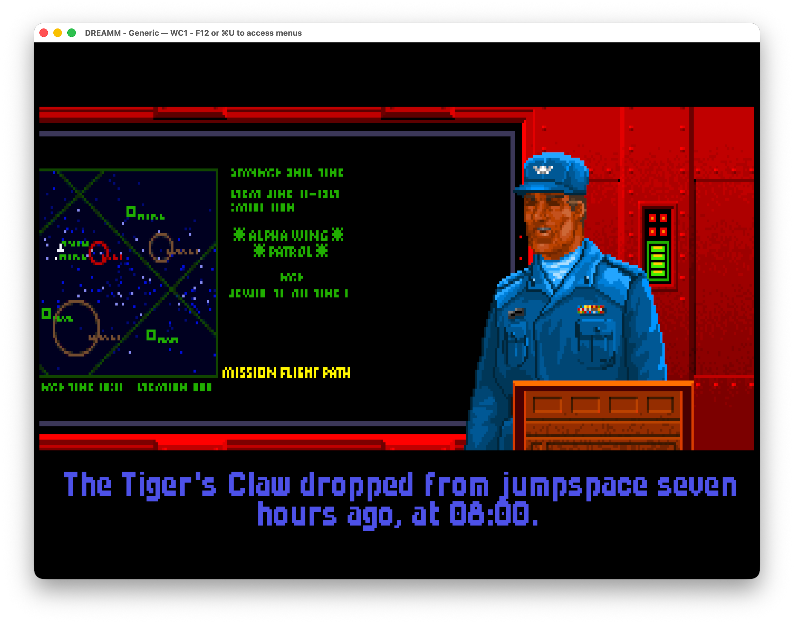
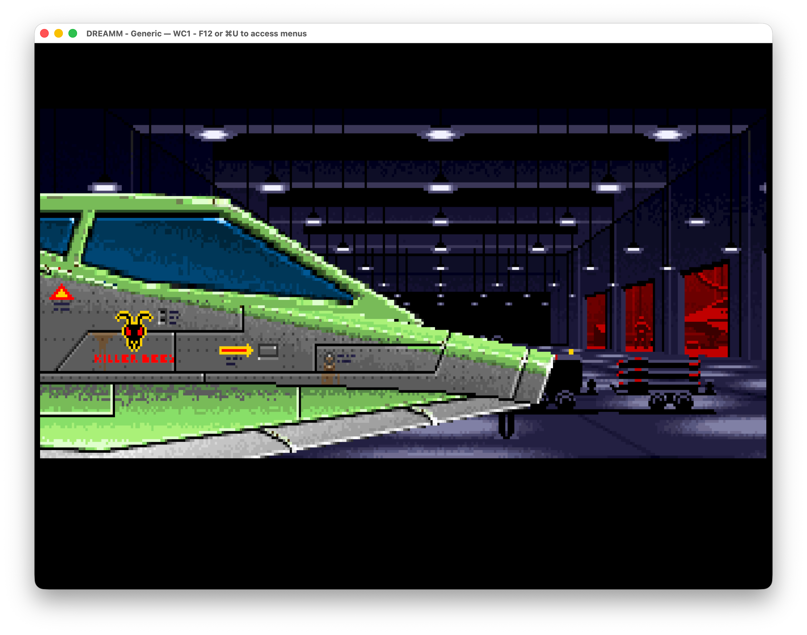
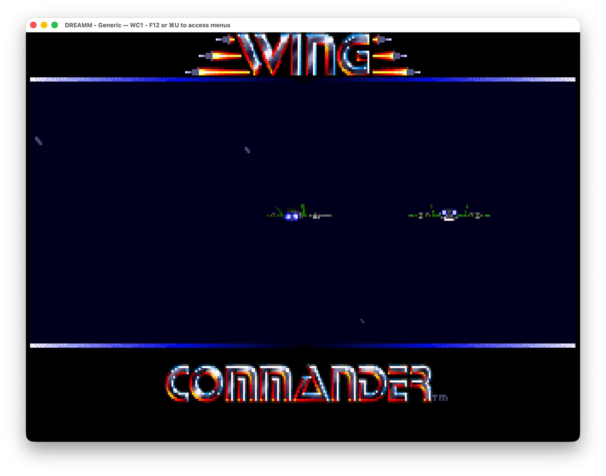
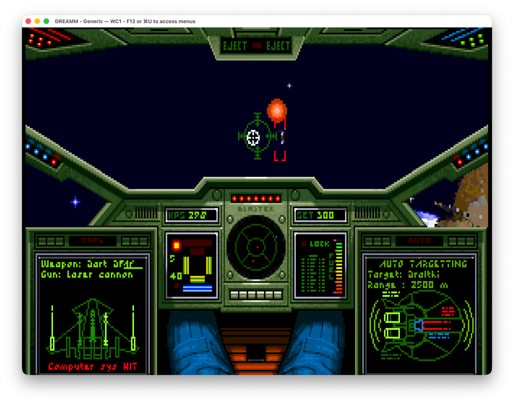
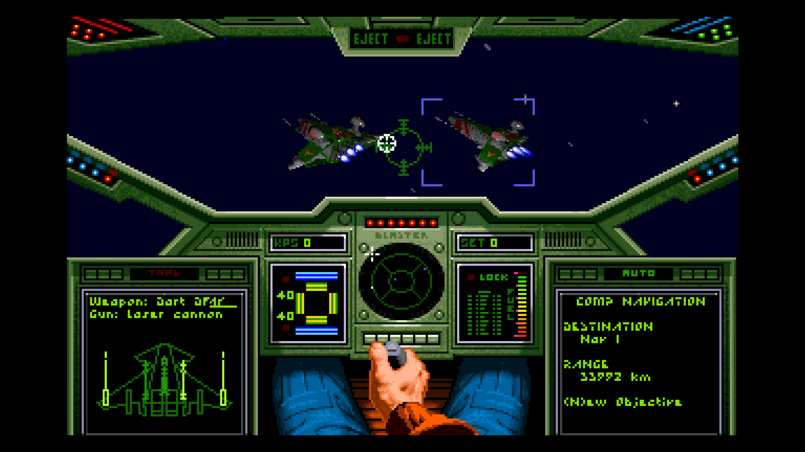
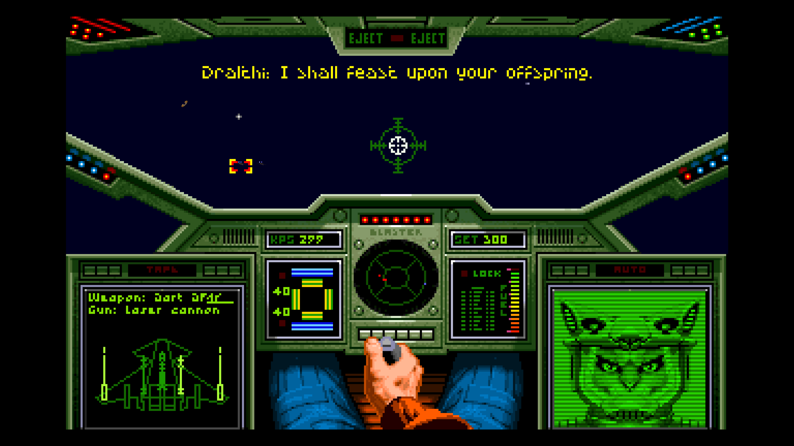

# Wing Commander source reconstruction and SDL2 port

This project recreates the source of **Wing Commander** as shipped in *Wing
Commander: The Kilrathi Saga* (1996). The reconstructed game core is C, the
`ix` audio library is C++, and the reference build uses Microsoft Visual C++
4.20 to reproduce the original Win32 executable as closely as possible.

A native SDL2 port is available for Windows, Linux, and macOS. It supports
Kilrathi Saga data and has partial support for the original DOS game data.

No copyrighted game data is included.

## Status

All 1,472 identified functions are accounted for: 1,470 have source
implementations and the remaining two are compiler-generated jump thunks that
must not be recreated manually.

`make progress` reports implementation coverage. `make report` calculates the
current per-function machine-code similarity to the retail executable; those
scores measure reconstruction fidelity, not gameplay completeness.

## Screenshots

| Mission briefing | Tiger's Claw hangar |
| --- | --- |
| [](screenshots/mission-briefing.png) | [](screenshots/tigers-claw-hangar.png) |

| Title sequence | Cockpit combat |
| --- | --- |
| [](screenshots/title-screen.png) | [](screenshots/cockpit-combat.png) |

## Download and run the SDL2 port

Download the archive for your platform from
[GitHub Releases](https://github.com/neuromancer/wc1-re/releases). Extract its
contents into an installed Kilrathi Saga or DOS Wing Commander directory and
keep the bundled runtime libraries beside the executable. Start it with that
directory as the working directory:

```sh
# macOS or Linux
cd /path/to/WC1
./wc1-modern
```

```powershell
# Windows PowerShell
cd C:\path\to\WC1
.\wc1-modern.exe
```

DOS game-data support is partial. Compressed packet resources, OriginFX/AdLib
music, and synthesized sound effects work, but other DOS-specific data or
behavior may remain unsupported.

### Enhanced renderer

Pass `--enhanced` to use the optional OpenGL renderer. It draws space objects
at output resolution while retaining the original indexed artwork, palettes,
cockpit, and HUD. The original software renderer remains the default.

```sh
./wc1-modern --enhanced
```

| Output-resolution ships | Cockpit combat |
| --- | --- |
| [](screenshots/enhanced-space-objects.webp) | [](screenshots/enhanced-cockpit-combat.webp) |

### SDL2 port controls

| Shortcut | Action |
| --- | --- |
| `Cmd+Enter` (macOS) | Toggle fullscreen |
| `Alt+Enter` (Windows and Linux) | Toggle fullscreen |
| `Cmd+Q` (macOS) | Quit the game |

During spaceflight, scroll the mouse wheel up or down to increase or decrease
speed.

## Build from source

Clone the submodules first:

```sh
git submodule update --init --recursive
```

### SDL2 port

Install a C/C++ compiler plus the SDL2 and LZO2 development packages, then run:

```sh
make -j modern
```

The executable is written to `out-modern/wc1-modern` (or
`out-modern/wc1-modern.exe` on Windows). `make run-modern` launches it with
Kilrathi Saga data in `data/full`; `make run-modern-dos` uses DOS data in
`data/dos`.

### Reconstructed Win32 build

The default target builds `WC1.EXE` with the original MSVC 4.20 toolchain under
wibo:

```sh
make -j
```

To run it, provide a Kilrathi Saga disc image. The Makefile extracts the game
data, substitutes the reconstructed executable, downloads DREAMM when needed,
and launches it in an emulated Windows 95 environment:

```sh
make run WC1_ISO=/path/to/kilrathi-saga.iso
```

Use `make debug WC1_ISO=/path/to/kilrathi-saga.iso` to start DREAMM's debugger.

## Reconstruction workflow

[`binary-comp`](https://github.com/gg-sl-oss/binary-comp) is required only for
comparison and verification commands:

```sh
python3 -m pip install "binary-comp[all] @ git+https://github.com/gg-sl-oss/binary-comp.git"
make compare-func FUNC=perform_maneuver
make verify
```

These commands require the retail executable at `data/full/WC1.ORI.EXE` and the
original-code exports under `code-full/`.

Contributor references are intentionally limited to:

- [compiler and flag evidence](docs/COMPILER.md);
- [matching patterns](docs/PATTERNS.md);
- [disassembly export workflow](docs/EXPORT.md);
- [compilation-unit order](docs/ORDER.md);
- [function naming policy](docs/LABELS.md);
- [SDL2 port architecture](docs/SDL2.md); and
- [release process](docs/RELEASING.md).

## License

See [LICENSE](LICENSE). OpenAI Codex and Anthropic Claude were used during the
reconstruction.
