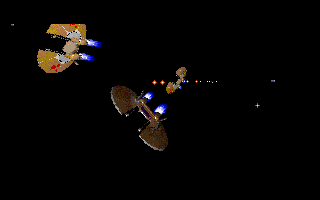
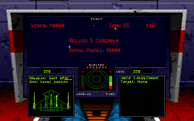

# Wing Commander source reconstruction

This project reconstructs the Win32 version of **Wing Commander** shipped in
*Wing Commander: The Kilrathi Saga* (1996). The goal is a complete, readable C/C++
codebase that builds a playable `WC1.EXE` and progressively matches the original binary's
behaviour and layout.

The game core is C, the `ix` audio library is C++, and the reconstruction uses Microsoft
Visual C++ 4.20 to preserve the original code generation.

## Status

1,038 of 1,459 identified developer functions are currently reimplemented (71.1%): 914 of
1,335 game functions and all 124 `ix` audio functions.

The reconstructed executable currently boots, plays the intro with music, displays
the main menu, starts a campaign, and enters the space-flight simulator with its cockpit and
HUD. Flight gameplay and later campaign flow are still incomplete.

Run `make progress` for the current per-file implementation counts.

## Screenshots

| Intro space battle | Space-flight simulator |
| --- | --- |
| [](screenshots/intro-space-battle.png) | [](screenshots/space-flight-simulator.png) |

## Build

Required tools and files:

- `make`, `curl` and `rust`;

From the repository root:

```sh
git submodule update --init --recursive
make -j
```

The resulting executable is `WC1.EXE`. The Makefile builds wibo and downloads the compatible
`msvcrt40.dll` automatically when needed.

## Run

Running requires `bsdtar` and the original Kilrathi Saga game data. Put a disc image in
`data/`, or pass its path explicitly:

```sh
make run WC1_ISO=/path/to/kilrathi-saga.iso
```

`make run` extracts the WC1 data, replaces the installed executable with the reconstructed
`WC1.EXE`, downloads [DREAMM](https://aarongiles.com/dreamm) when necessary, and launches the
game. Use `make debug WC1_ISO=/path/to/kilrathi-saga.iso` to launch DREAMM's debugger.

## Optional binary verification

[`binary-comp`](https://github.com/gg-sl-oss/binary-comp) is an optional analysis tool. To install it:

```sh
python3 -m pip install "binary-comp[all] @ git+https://github.com/gg-sl-oss/binary-comp.git"
```

Only comparison targets such as `make report` and `make verify` require the retail executable
at `data/full/WC1.ORI.EXE` and the original-code exports in `code-full/`. See
[`docs/EXPORT.md`](docs/EXPORT.md) for that separate reverse-engineering workflow.
